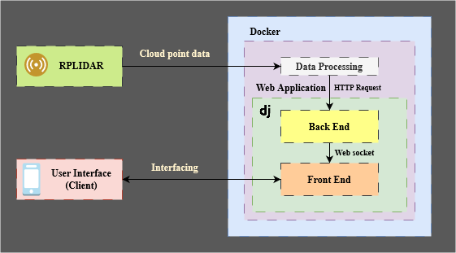

# Docker Stack
This docker container facilitate the deployment process of SLSfEi System by automatically build and install all dependencies for [SLSfEi/web-app](https://github.com/SLSfEi/web-app) and [SLSfEi/scan-provider-cpp](https://github.com/SLSfEi/scan-provider-cpp)

# Configurations
The configuration file `driver_config.ini` is based on `config.ini` from [SLSfEi/scan-provider-cpp](https://github.com/SLSfEi/scan-provider-cpp)